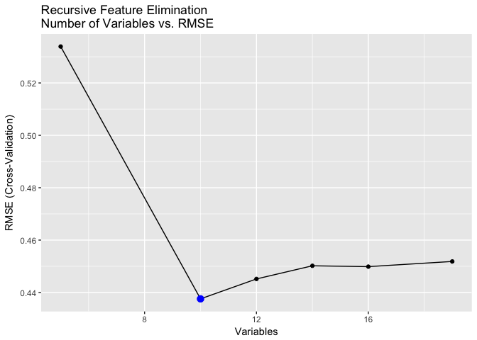
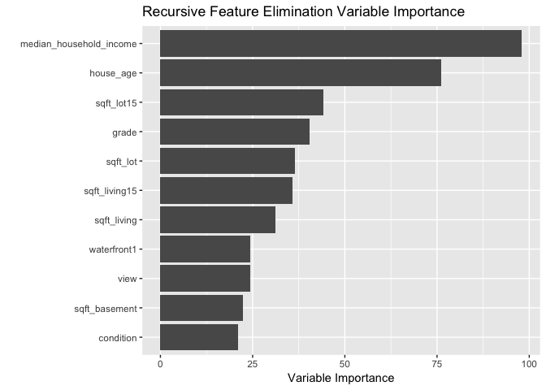
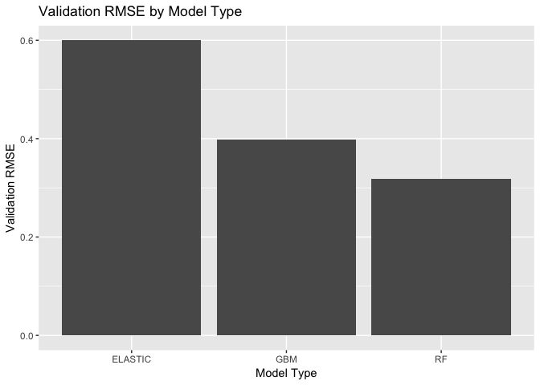

MS&E 226 Mini-Project Part 2
================
Samuel Hansen & Sarah Rosston
11/13/2016

``` r
# Initialize libraries
library(stringr)
library(hydroGOF)
library(lubridate)
library(knitr)
library(caret)
library(tidyverse)
# Define input file
zipcode_file <- "../zipcode_stats.csv"
file_in <- "../data/train.csv"
```

``` r
# Read in data
df <- read_csv(file_in) %>%
  dmap_at("date", ~ymd(.x)) %>%
  left_join(read_csv(zipcode_file)) %>%
  dmap_at("median_household_income", as.double) %>%
select(-X3) 
```

Summary
=======

In part 2 of our mini-project, we built regression and classification models of `home price`. Our report describes the steps we took for data cleaning, pre-processing, feature selection, model fitting, and evaluation.

Data Cleaning
=============

This section describes the steps we took to engineer features, include external variables, split, and preprocess our data prior to model building.

Feature Engineering
-------------------

Prior to model building, we engineered the following features from raw values:

1.  Years since renovation: `renovation_year` - `year_built`
2.  House age at time of sale: `sale_year` - `year_built`
3.  Season of sale: Fall (9 &lt;= `sale_month` &lt;= 12), Winter (1 &lt;= `sale_month` &lt;= 4), etc.
4.  Price over median: Boolean stating whether `price > median(price)`

``` r
df <- df %>%
  # Recode "waterfront" to factor
  dmap_at("waterfront", as.factor) %>%
  mutate(
    years_since_renovation = ifelse(yr_renovated == 0, 0, yr_renovated - yr_built),
    sale_year = year(date), 
    sale_month = month(date), 
    house_age = sale_year - yr_built,
    sale_season = ifelse(sale_month <= 4, "Winter", 
                    ifelse(sale_month <= 5, "Spring",
                           ifelse(sale_month <= 8, "Summer", 
                                  ifelse(sale_month <= 12, "Fall")))),
    # Defines binary response variable 
    price_over_median = ifelse(price > median(price), 1, 0)
  ) %>%
  # Remove extraneous variables 
  select(-c(id, date, yr_built, yr_renovated, zipcode, lat, long, sale_year, sale_month))
```

Added Features
--------------

To enhance our predictive models, we researched the median household incomes for zipcodes in Cook County, and joined this variable into our data frame. We hypothesized median household income is predictive of home price because wealthier families tend to live in pricier housing areas.

Data Splitting
--------------

In order to obtain estimates of generalization error, we split our data to include 80% training and 20% validation sets. We fit all regression and classification models on the training data and evaluate their performance on the held-out validation set.

``` r
# Split data into train and validation sets 
percent_in_train <- 0.7
train_indicies <- sample(nrow(df), size = percent_in_train*nrow(df))
train <- df[train_indicies, ]
validation <- df[-train_indicies, ]
```

Data Preprocessing
------------------

Several variables are on largely different scales; for instance, `home price` varies in dollar amounts from $75,000 to $7,700,000, whereas `number of bathrooms` ranges from 0 to 8. In turn, we center and scale the predictors in order to apply regularization techniques during the modeling phase. Further, we impute the few missing values of `median household income` with the column median.

``` r
# Define pre-processing steps to apply to training data
preProcessSteps <- c("center", "scale", "medianImpute")
# Apply same pre-processing steps to validation set
preProcessObject <- preProcess(train, method = preProcessSteps)
train <- predict(preProcessObject, train)
validation <- predict(preProcessObject, validation)
```

Regression
==========

We first aim to build a predictive model of `home price`. To do so, we perform recusrive feature elimination to select our feature set, fit 5 different predictive models using 10-fold cross-validation, then evaluate their performance on a held-out validation set to estimate the generalization error.

Feature Selection
-----------------

We perform feature selection using recursive feature elimination with 10-fold cross-validation. This method uses the `rfFuncs` parameter, which uses random forests to remove variables with low variable importance.

``` r
# set.seed(1234)
# rfe.cntrl <- rfeControl(functions = rfFuncs,
#                       method = "cv",
#                       number = 5)
# 
# train.cntrl <- trainControl(selectionFunction = "oneSE")
# num_vars <- c(5,10,12,14,16)
# # Commented out to speed up runtime 
# rfe.results <- rfe(price~., train %>% select(-price_over_median),
#                rfeControl = rfe.cntrl,
#                preProc = preProcessSteps,
#                sizes = num_vars,
#                metric = "RMSE",
#                trControl = train.cntrl)
rfe.results <- read_rds("../models/rfe.results.rds")
```

The following table shows that recursive feature selection chooses 10 variables to include in subsequent model building.

``` r
print(rfe.results)
```

    ## 
    ## Recursive feature selection
    ## 
    ## Outer resampling method: Cross-Validated (5 fold) 
    ## 
    ## Resampling performance over subset size:
    ## 
    ##  Variables   RMSE Rsquared  RMSESD RsquaredSD Selected
    ##          5 0.5339   0.7291 0.05152    0.01349         
    ##         10 0.4376   0.8134 0.04067    0.01511        *
    ##         12 0.4452   0.8054 0.02997    0.01678         
    ##         14 0.4502   0.8015 0.02830    0.01297         
    ##         16 0.4499   0.8016 0.02870    0.01318         
    ##         19 0.4518   0.7997 0.03042    0.01214         
    ## 
    ## The top 5 variables (out of 10):
    ##    median_household_income, house_age, sqft_lot15, grade, sqft_lot

The procedure selects 5 variables because RMSE is minimized (see plot below):

``` r
ggplot(rfe.results) +
  labs(title = "Recursive Feature Elimination\nNumber of Variables vs. RMSE")
```



The variable importance of the predictors is shown below:

``` r
data_frame(predictor = rownames(varImp(rfe.results)), 
           var_imp = varImp(rfe.results)$Overall) %>%
  ggplot(mapping = aes(x = reorder(predictor, var_imp), y = var_imp)) +
  geom_bar(stat = "identity") +
  coord_flip() +
  labs(x = "", y = "Variable Importance", 
       title = "Recursive Feature Elimination Variable Importance")
```



We observe that `median household income` is, by far, the most important predictor of price selected via cross-validated recursive feature elimination. This technique selects the following variables for model building:

``` r
(selected_vars <- map(predictors(rfe.results), ~str_match(.x, names(df))) %>% 
  unlist() %>% 
  .[!is.na(.)] %>%
  unique())
```

    ##  [1] "median_household_income" "house_age"              
    ##  [3] "sqft_lot"                "sqft_lot15"             
    ##  [5] "grade"                   "sqft_living"            
    ##  [7] "sqft_living15"           "view"                   
    ##  [9] "waterfront"              "sqft_basement"

``` r
train_selected_vars <- train %>%
  select(one_of(selected_vars), price)
```

Model Fitting
-------------

Having selected the features to include in our models, we define univseral cross-validation parameters to apply to in all modeling techniques. Specifically, models that require tuning parameters will select the optimal parameter set by undergoing 10-fold cross-validation and applying the "one-standard error rule." In other words, this approach will select the simplest parameters that obtain the minimal cross-validation error within one standard error of the minimum.

``` r
cvCtrl <- trainControl(method = "cv", 
                       number = 10,
                       selectionFunction = "oneSE")
```

### Ordinary Least Squares Regression

SARAH: - Include 2 linear models - consider interaction terms - look at residuals - remove outliers and update training data for future models

``` r
lm.fit1 <- lm(price~., data = train_selected_vars)
# lm.fit2 SOMETHING ELSE  
```

### Elastic Net Regularized Regression Model

``` r
# Fit penalized logistic regression model (elastic net)
# set.seed(1234)
# elastic.fit <- train(price ~ .,
#                    data = train_selected_vars,
#                    preProc = preProcessSteps,
#                    method = "glmnet",
#                    trControl = cvCtrl)
elastic.fit <- read_rds("../models/elastic.fit.rds")
```

### Random Forest Model

Given that the population model of `home price` may be nonlinear, we built a random forest predictive model, which is a tree-based ensemble technique. We use 10-fold cross-validation to select the optimal `mtry` parameter, which represents the number of random variables to select when fitting each tree.

``` r
# # Define tuning paramter grid
# rfGrid <- expand.grid(.mtry = c(3,4,5,6))
# # Fit random forest model
# set.seed(1234)
# rf.fit <- train(price ~ .,
#                 data = train_selected_vars,
#                 preProc = preProcessSteps,
#                 method = "rf",
#                 tuneGrid = rfGrid,
#                 trControl = cvCtrl)
rf.fit <- read_rds("../models/rf.fit.rds")
```

### Gradient Boosting Machine Model

We also fit a gradient boosting machine, which is also tree-based method that combines an ensemble of weak learners into one strong learner. We use cross-validation to perform a grid search over three parameters: `interaction.depth`, which represents the maximum number of splits each tree can have, `n.trees`, which represents the number of boosting iterations to perform, and `shrinkage`, which is the learning rate. After finding the optimal set of parameters, we keep the model that achieves the lowest cross-validation error within one standard error of the minimum.

``` r
# Define grid of tuning parameters
# gbmGrid <-  expand.grid(interaction.depth = c(1, 2, 3),
#                         n.trees = (1:20)*100,
#                         shrinkage = seq(.0005, .05, .005),
#                         n.minobsinnode = 10)
# # Fit GBM model
# set.seed(1234)
# gbm.fit <- train(price ~ .,
#                 data = train_selected_vars,
#                 preProc = preProcessSteps,
#                 method = "gbm",
#                 tuneGrid = gbmGrid,
#                 verbose = FALSE,
#                 trControl = cvCtrl)
gbm.fit <- read_rds("../models/gbm.fit.rds")
```

Regression Evaluation
---------------------

To compare the performance of our regression techniques, we predict the `price` of homes in the held-out validation set.

``` r
evalResults <- tibble(# LM = predict(lm.fit, newdata = validation) %>% 
                      # rmse(sim = ., obs = validation$price),
                      ELASTIC = predict.train(elastic.fit, newdata = validation) %>%
                        rmse(sim = ., obs = validation$price),
                      RF = predict.train(rf.fit, newdata = validation) %>% 
                        rmse(sim = ., obs = validation$price),
                      GBM = predict.train(gbm.fit, newdata = validation) %>% 
                        rmse(sim = ., obs = validation$price))

evalResults %>%
  gather(model_type, rmse, ELASTIC:GBM) %>%
  ggplot(mapping = aes(x = reorder(model_type, desc(rmse)), y = rmse)) +
  geom_bar(stat = "identity") +
  scale_y_continuous() +
  labs(x = "Model Type", y = "Validation RMSE", 
       title = "Validation RMSE by Model Type")
```



SAM: - SUMMARIZE FINDINGS HERE

Classification
==============

SARAH: - Add 2 logistic regression models

``` r
# logit.fit1
# logit.fit2
```

SAM:

Model Fitting
=============

We define the cross-validation controls as follows:

``` r
cvCtrl <- trainControl(method = "cv", 
                       number = 10,
                       summaryFunction = twoClassSummary, 
                       selectionFunction = "oneSE",
                       classProbs = TRUE)
```

Random Forest Model
-------------------

``` r
# # Define tuning paramter grid
# rfGrid <- expand.grid(.mtry = c(4,5,6,7))
# # Fit random forest model
# set.seed(1234)
# rf.fit <- train(price_over_median ~ .,
#                 data = train,
#                 preProc = preProcessSteps,
#                 method = "rf",
#                 tuneGrid = rfGrid,
#                 trControl = cvCtrl,
#                 na.action = na.roughfix,
#                 metric = "ROC")
```

Gradient Boosting Machine
-------------------------

``` r
# # Define tuning paramter grid
# gbmGrid <- expand.grid(interaction.depth = c(1, 2, 3),
#                         n.trees = (1:20)*100,
#                         shrinkage = seq(.0005, .05, .005),
#                         n.minobsinnode = 10)
# # Fit GBM model
# set.seed(1234)
# gbm.fit <- train(price ~ .,
#                 data = train,
#                 preProc = preProcessSteps,
#                 method = "gbm",
#                 tuneGrid = gbmGrid,
#                 trControl = cvCtrl,
#                 na.action = na.roughfix,
#                 metric = "ROC")
```

Support Vector Machine with Radial Kernel
-----------------------------------------

``` r
# # Define tuning paramter grid
# svmGrid <- expand.grid(.sigma = 0.003408979,
#                        .C = c(0.005, 0.05, 0.15, 0.25, 0.35, 0.45, 0.5))
# # Fit SVM model
# set.seed(1234)
# svm.fit <- train(price ~ .,
#                 data = train,
#                 preProc = preProcessSteps,
#                 method = "svmRadial",
#                 tuneGrid = svmGrid,
#                 trControl = cvCtrl,
#                 na.action = na.roughfix,
#                 metric = "ROC")
```

Classification Evaluation
-------------------------

``` r
# # Evaluate all models on held-out validaion set 
# evalResults <- data.frame(dead6m = validation$price_over_med)
# evalResults$LOGIT <- predict(logit.fit, validation, type = "prob")
# evalResults$GBM <- predict(gbm.fit, validation, type = "prob")
# evalResults$SVM <- predict(svm.fit, validation, type = "prob")
# evalResults$RF <- predict(rf.fit, validation, type = "prob")
# evalResults <- evalResults %>%
#   gather(model_type, predicted_prob, LOGIT:RF) 
```

Calibration Plots
-----------------

``` r
# # Make calibration plots, facetted by model type
# model_labels <- c("LOGIT" = "Logistic Regression",
#                   "SVM" = "Support Vector Machine", 
#                   "GBM" = "Gradient Boosting Machine",
#                   "RF" = "Random Forest")
# evalResults %>%
#   mutate(prob_bin = cut(predicted_prob, breaks = seq(-0.05, 1.0, by = 0.05))) %>% 
#   group_by(prob_bin, model_type) %>%
#   summarise(prob_high_price = mean(price, na.rm = TRUE),
#             n = n()) %>%
#   filter(!is.na(prob_bin)) %>% 
#   bind_cols(., pred_prob_midpoints) %>%
#   ungroup() %>%
#   ggplot(mapping = aes(x = midpoint, y = prob_high_price, label = n)) +
#   geom_line() +
#   geom_point(mapping = aes(size = n)) +
#   geom_text_repel(mapping = aes(color = "red")) +
#   annotate(geom = "segment", x = 0, xend = 1, y = 0, yend = 1, 
#            color = "black", linetype = 2) +
#   scale_x_continuous(labels = scales::percent,
#                      breaks = seq(0, 1, by = 0.1)) +
#   scale_y_continuous(labels = scales::percent,
#                      breaks = seq(0, 1, by = 0.1)) +
#   scale_colour_discrete(guide = FALSE) +
#   scale_size(name = "Number of\nPredictions",
#              labels = scales::comma) +
#   labs(x = "Predicted Probability Price > Median (Bin Midpoint)",
#        y = "Actual Probability Price > Median",
#        title = "Calibration Plot: Predicted vs. Actual Probability Home Price > Median") +
#   facet_wrap(~model_type, labeller = labeller(model_type = model_labels))
```

``` r
# EXTRA: CORRELATION PLOT
# library(corrplot)
# M <- cor(df %>% select(-c(waterfront, sale_season)), use = "pairwise.complete.obs")
# corrplot(M, method="number")
```
