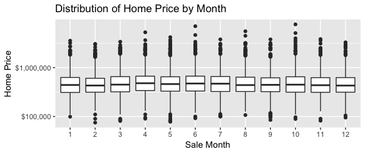

```{r setup, include=FALSE}
knitr::opts_chunk$set(echo = FALSE, message = FALSE, warning = FALSE, 
                      cache = TRUE, fig.width = 6, fig.height = 3)
```

```{r}
# Initialize libraries
library(hydroGOF)
library(lubridate)
library(caret)
library(boot)
library(tidyverse)

# Define input files
zipcode_file <- "../zipcode_stats.csv"
test_file_in <- "../data/test.csv"
train_scaled_file_in <- "../data/train_scaled.rds"
selected_vars_file_in <- "../models/selected_vars.rds"
preProcessObject_file_in <- "../models/preProcessObject.rds"
rf_fit_file_in <- "../models/rf.fit.rds"
rf_class_fit_file_in <- "../models/rf.class.fit.rds"

# Read in scaled train data
train <- read_rds(train_scaled_file_in)

# Read in test data and perform data cleaning
test <- read_csv(test_file_in) %>%
  dmap_at("date", ~ymd(.x)) %>%
  
  # Join in median income data 
  left_join(read_csv(zipcode_file)) %>%
  dmap_at("median_household_income", as.double) %>%
  select(-X3)  %>%
  
  # Recode "waterfront" to factor
  dmap_at("waterfront", as.factor) %>%
  
  # Perform feature engineering 
  mutate(
    years_since_renovation = ifelse(yr_renovated == 0, 0, yr_renovated - yr_built),
    sale_year = year(date), 
    sale_month = month(date), 
    house_age = sale_year - yr_built,
    sale_season = ifelse(sale_month <= 4, "Winter", 
                    ifelse(sale_month <= 5, "Spring",
                           ifelse(sale_month <= 8, "Summer", 
                                  ifelse(sale_month <= 12, "Fall")))),
    
    # Define binary response variable 
    price_over_median = ifelse(price > median(price), "yes", "no")
  ) %>%
  
  # Remove extraneous variables 
  select(-c(id, date, yr_built, yr_renovated, zipcode, lat, long, sale_year, sale_month))
```

#Summary

In part 3 of our mini-project, we evaluated the performance of our 
regression and classification models of home price on a held-out test set. 
Further, we fitted linear models to the train and test sets, from which we 
employed inference techniques to analyze the significance and spread of our 
coefficient estimates.

#Prediction on the Test Set

Before evaluating the test error from our regression and classification models,
we applied the same scaling and variable transformations from the training
set to the test set. To do so, we used column means and standard 
deviations calculated using the training set to center and scale the test set. 

```{r}
# Apply scaling from training set to test set 
preProcessObject <- read_rds(preProcessObject_file_in)
test <- predict(preProcessObject, test)
```

In part 2 of our mini-project, we found that random forest regression and 
classification models yielded the smallest validation error out of all
models tested. We chose these as our "best" models, and evaluated them on 
a held-out test set. The following figure compares our *estimates* of the test 
error obtained from predicting the validation set along with the *true* test 
errors. We observe that the validation error was an underestimate of the test 
error in both the regression and classification models as we predicted in part
2 of the mini-project. Nevertheless, we observe that our random forest classifier is still fairly accurate, obtaining an 87% 
accuracy on the test set. 

```{r}
# Load in best regression and classification models 
rf.fit <- read_rds(rf_fit_file_in)
rf.class.fit <- read_rds(rf_class_fit_file_in)

# Compute tibble of errors
results <- data_frame(
  data_source = c("Validation", "Validation", "Test", "Test"),
  model_type = c("Regression", "Classification", "Regression", "Classification"),
  error = c(0.337, 
            0.055, 
            predict(rf.fit, newdata = test) %>% rmse(sim = ., obs = test$price),
            data.frame(price_over_median = test %>% 
                                     select(price_over_median)) %>%
            bind_cols(data.frame(pred_class = 
                                   predict(rf.class.fit, test, type = "raw"))) %>%
            summarise(missclass_error = 
                        1 - mean(price_over_median == pred_class)) %>%
            c() %>%
            .$missclass_error
            )
)

# Make barplot comparing errors 
results %>% 
  ggplot(mapping = aes(x = data_source, y = error)) +
  geom_bar(stat = "identity") +
  facet_wrap(~model_type, scales = "free") +
  labs(x = "Data Source", y = "Missclass. Error for Classification,\nRMSE for Regression",
       title = "Test error by Model Type and Data Source")


```

#Inference 

```{r}
#selected_vars <- read_rds(selected_vars_file_in)
selected_vars <- c("waterfront", "grade", "sqft_living",
                   "house_age", "median_household_income",
                   "sqft_living15", "sqft_lot15")
```

To perform inference, we used a linear regression model that includes only
the `r length(selected_vars)` features selected by recursive feature elimination
on the training set from part 2 of our mini-project. These features represent
the subset that minimized 10-fold cross-validation error according to the 
one-standard error rule. Note that these features are scaled. 

##A: Coefficients from Linear Model on Training Set 

```{r}
lm.train.fit <- lm(price~., data = train %>%
  select(one_of(selected_vars), price))
# summary(lm.train.fit)
```
A linear regression model fit to the training set revealed that 
nearly all features have statistically significant p-values, meaning 
there is low probability of observing the data, given the null hypothesis 
was true. For instance, `median household income` has $p < 2e^{-16}$, meaning
the probability that we observed the data with *no relationship* between `price`
and `median household income` is less than $2e^{-16}$. 

The features that exhibit the most statistically significant relationships
with `price` are `median_household_income`, `house_age`, `grade`, 
`living area square footage`, `view`, and `waterfront`, which all have 
$p < 2e^{-16}$. These results are consistent with intuition because pricier
homes are often large, overlook waterfront views, and are located in wealthy zip
codes. Further it seems reasonable that cheaper homes tend to be smaller 
compared to their neighbors. The only surprising result is that older homes
tend to be more expensive; however, this may be due to the location of older 
homes in coveted properties (i.e. near city centers). Taken together, the 
features with the most significant coefficients tell a plausible story. 

##B: Coefficients from Linear Model on Test Set 

Next, we fit a linear regression model with the same features on the test set.
The most significant coefficients (i.e. those with $p < 2e^{-16}$), are the 
**same** as those obtained from fitting the linear model on the training set. 

However, weakly significant coefficients such as `basement square feet` and 
`ratio of living area square feet to 15 neighbors` had slightly different 
p-values compared to those from the training set model. The biggest change
is that `lot size ratio to neighbors` (i.e. `sqft_lot15`) dropped from 
$p < 1.25e{-08}$ in the training set model to $p < 0.061485$ in the test set 
model. This is likely because `sqft_lot15` is collinear with `sqft_living15`, 
`sqft_lot`, and `sqft_living`, which in turn, yields unstable coefficient 
and p-value estimates. 

```{r}
lm.test.fit <- lm(price~., data = test %>%
  select(one_of(selected_vars), price))
# summary(lm.test.fit)
```

##C: Bootstrapped Confidence Intervals

We fit linear models to 1000 bootstrapped samples of the training data
to estimate the standard error of the coefficients. Additionally, we constructed
95% confidence intervals for each of the regression coefficients, which are
shown in the plot below. 

```{r}
# Define bootstrap function 
boot.fn = function(input_data,index){
  return(coef(lm(price~., data = input_data, subset = index)))
}

# Fit linear models to 1000 bootstrap samples to estimate std. error 
ITERATIONS = 1000
set.seed(1)
lm.bootstrap = boot(data = train %>% select(one_of(selected_vars), price), 
                 statistic = boot.fn, 
                 R = ITERATIONS)
 #print(lm.bootstrap)
```

```{r}
# summary(lm.bootstrap) %>%
#   bind_cols(data_frame(variable = names(lm.train.fit$coefficients))) %>%
#   mutate(confint_2.5 = original - bootSE,
#          confint_97.5 = original + bootSE) %>%
#   ggplot(mapping = aes(x = reorder(variable, original), y = original)) +
#   geom_point() +
#   geom_errorbar(mapping = aes(ymax = confint_97.5, ymin = confint_2.5)) +
#   coord_flip() +
#   labs(x = "", y = "Coefficient Estimate", 
#        title = "Bootstrapped 95% Confidence Interval of Coef. Estimate")
  
```


```{r}
# data.frame(summary(lm.train.fit)$coefficients) %>%
#   bind_cols(data_frame(variable = names(lm.train.fit$coefficients))) %>%
#   transmute(variable = variable,
#             confint_2.5 = Estimate  - 1.96 * Std..Error,
#             confint_97.5 = Estimate + 1.96 * Std..Error,
#             original_reg = Estimate) %>%
#   ggplot(mapping = aes(x = reorder(variable, original), y = original)) +
#   geom_point() +
#   geom_errorbar(mapping = aes(ymax = confint_97.5, ymin = confint_2.5)) +
#   coord_flip() +
#   labs(x = "", y = "Coefficient Estimate", 
#        title = "Regression 95% Confidence Interval of Coef. Estimate")
```


```{r}
reg_table <- data.frame(summary(lm.train.fit)$coefficients) %>%
  bind_cols(data_frame(variable = names(lm.train.fit$coefficients))) %>%
  transmute(variable = variable,
            confint_2.5_reg = Estimate  - 1.96 * Std..Error,
            original_reg = Estimate,
            confint_97.5_reg = Estimate + 1.96 * Std..Error)
```

```{r}
boostrap_table <- summary(lm.bootstrap) %>%
  bind_cols(data_frame(variable = names(lm.train.fit$coefficients))) %>%
  mutate(confint_2.5_boot = original - bootSE,
         confint_97.5_boot = original + bootSE,
         original_boot = original) %>%
  select(variable, confint_2.5_boot, original_boot, confint_97.5_boot)
```

```{r}
inner_join(reg_table, boostrap_table)  %>%
  ggplot(mapping = aes(x = reorder(variable, original_reg))) +
  geom_point(aes(y = original_reg, color = "regression")) +
  geom_point(aes(y = original_boot, color = "bootstrap")) +
  geom_errorbar(mapping = aes(ymax = confint_97.5_reg, ymin = confint_2.5_reg, color = "regression")) +
  geom_errorbar(mapping = aes(ymax = confint_97.5_boot, ymin = confint_2.5_boot, color = "bootstrap")) +
  scale_color_discrete(name = "CI Source") +
  coord_flip() +
  labs(x = "", y = "Coefficient Estimate", 
       title = "95% Confidence Interval of Coef. Estimate")
```


The confidence intervals are very similar for all variables except for whether
a house is by the waterfront. For all other variables, the bootstrapped
confidence intervals are slightly smaller than the ones found using regression.
Because the bootstrap method of constructing confidence intervals does not rely
on the assumption that errors are normally distributed, it makes sense that 
the bootstrapped confidence interval would be larger for a binary variable with 
relatively few observations of one class (only 85 homes out of the 12103 in the 
training set are waterfront homes). For all other variables, there is far more 
variety in the observations, so the confidence intervals from both regression 
and bootstrapping are small.

##D: Comparison to Full Model 

Since our original linear model only included a subset of the predictors, we fit 
another linear regression model to include *all* features in the 
training set. The most significant coefficients
(i.e. those with $p < 2e^{-16})$ from the original model are also the most 
significant coefficients in the full model. The fact that the most significant
coefficients *did not change* suggests our sparser model is 
correctly capturing important signals present in the full model. 

Because more features were included in the full model, we also observe 
several *new* features that exhibit highly significant relationships 
with `home price`, including `number of bedrooms` and `number of bathrooms`. 
It is consistent with intuition that these variables would be significantly
related to `home price`; however, they were omitted in our original model 
because recursive feature elimination determined they did not contribute 
enough signal to warrant inclusion. 


```{r}
lm.train.all.fit <- lm(price~., data = train %>% select(-price_over_median))
# summary(lm.train.all.fit)
```

##E: Potential Problems with Linear Model 

###Post-Selection Inference 
We performed feature selection using our training data before fitting a
model. The decision to use selected features that were correlated with the
training data implies the p-values from our model on the training data are
downwardly biased. Inspecting the linear model fit on the test test would yield
less biased results for p-values. However, this approach yields p-values with 
higher variance because the test set is much smaller than the training set. 
When we look at p-values on the training set, we find that all variables have a 
p-value less than 0.05, but on the test set `lot size ratio to neighbors` 
does not.

However, weakly significant coefficients such as `basement square feet` and 
`ratio of living area square feet to 15 neighbors` had slightly different 
p-values compared to those from the training set model. The biggest change
is that `lot size ratio to neighbors` (i.e. `sqft_lot15`) dropped from 
$p < 1.25e{-08}$ in the training set model to $p < 0.061485$ in the test set 
model. This is likely because `sqft_lot15` is collinear with `sqft_living15`, 
`sqft_lot`, and `sqft_living`, which is turn, yields unstable coefficient 
and p-value estimates. 

###Collinearity
The variables `sqft_lot15`, `sqft_living15`, `sqft_lot`, and `sqft_living` are
collinear, which means that coefficient estimates and p-values are unstable 
for these variables. This collinearity could also explain why `sqft_lot15` was 
significant when we fit the model to the training set but insignificant 
when we fit it to the test set. 

###Multiple hypothesis testing
Because we are testing the significance of multiple variables, if we simply
consider all variables with p-values < 0.05 significant, we expect to reject
5% of null hypotheses even when they are correct. However, even after applying
the Bonferonni correction, we found that p-values remained significant for 
variables selected via recursive feature elimination.
```{r}
# data.frame(summary(lm.train.fit)$coefficients) %>%
#   bind_cols(data_frame(variable = names(lm.train.fit$coefficients))) %>%
#   transmute(variable = variable,
#             corrected.p = Pr...t../8,
#             less.than.0.05 = corrected.p < 0.05)
```

##F: Causal Relationships

For the variables `waterfont`, `grade`, `sqft_living`, and 
`median_household_income`, the coefficients are in the same direction we would
have expected before looking at the results of model fitting. 
Because `sqft_living`, `sqft_living15`, and `sqft_lot15` are collinear, we are 
not sure which (if any) actually causes the price of a home to change, although
`sqft_living` has the lowest p-value and highest coefficient, matching what we
would have predicted.

For `median_household_income`, the regression coefficient shows that home prices
increase with median household income, but this could be a cause of the
school performance or safety in an area, both of which are positively correlated
with median household income but were included not in our dataset.
`Waterfont` and `grade` are far less correlated with other variables, have 
extremely low p-values, and possess coefficients similar to what we would have 
predicted before modeling: waterfront homes are much more expensive, and homes 
in better condition are more expensive.

#Discussion 

##A: Practical Applications

Practically speaking, our random forest regression model would be best suited 
for predicting `home price` because it achieves relatively low generalization
error on unseen data. A home-buyer or realtor in the Seattle area would benefit
from obtaining a rough estimate of the price of a home prior to buying or 
selling. However, the random forest model is a "black box," meaning 
one cannot determine the degree to which particular features contribute to home
price. Instead, one could use our original linear model to infer
how various features of a home relate to its price. For instance, our linear
model provides several statistically significant heuristics: expensive homes 
tend to be older, larger, located in wealthy areas, and overlook the water. 
Such information could guide home-buyers on where to find homes within budget. 
However, a likely pitfall would be using our models for prediction or inference 
with data from another region. Indeed, the scope of our models are limited to 
King County in Washington. 

##B: Model Refitting

Our models should be refitted when the training data fails to account for 
price fluctuations in the King County housing market. For instance, if 
the housing market underwent a sudden shock (e.g. from a earthquake), our 
models, which are trained on historical data, would not generalize well. 
Similarly, if the housing market underwent a recession, our models 
would likely systematically overestimate home prices, resulting
in increased error. Our models should be refitted immediately after such 
extreme events so that the training data better resemble the test data. 

We also inspected whether our data exhibited seasonal trends in home sale 
prices to assess whether predictive models should be constructed over smaller
periods. As shown in Fig. 1, there is no discernible difference 
in home price over the 12 months for which data were collected. This suggests
it was appropriate to build models using data from the entire year. However, 
data collected over a larger time frame may reveal temporal trends. To account
for such trends, predictive models should be augmented to include time-series 
information, or fit on data that does not exhibit temporal trends. 



##C: Caveats
Someone looking at our analysis should be aware that we only have data for one
year -- from May 2014 to May 2015, so the model would likely not generalize well
to home prices outside that time period.
Because our features include some collinearity, the coefficients on some
features, particularly the two describing the neighboring homes, might not 
fully reflect the relationship between home price and the feature. 
We also performed feature selection before fitting a model, which means we might
be overstating the correlation between the features and home price. 

##D: Data Collection

There are several external features that could improve model 
performance. First, `school district rating` would likely be predictive of home
price because home-buyers typically want to send their children to good schools.
In turn, demand for homes in good school districts is higher, which is often
associated with higher homes prices. Second, it would be useful to know how 
long a home has been on the market before its sale. Undesirable homes are
typically on the market for much longer than desirable ones, that likely 
spend less time on the market. Third, given that many homes in the data set 
are located in urban centers, it would be valuable to know the distance to the 
nearest transportation hub for each home. Home-buyers often value the convenience 
of local transportation options, so homes closer to bus or subway stops may be 
more expensive. Taken together, these features may add predictive power
to future models. 

##E: Different Approaches
If we were to look at this data set again, there are several things we would
do differently. First, we would consider a more sophisticated classification 
response variable than whether a home is priced above or below the median price. 
For instance, we would examine whether a home is a good "bargain" by examining
whether its price is above or below those of the 10-15 closest homes, as 
measured by Haversine distance from GPS coordinates. 

Second, assuming inference was our main priority (as opposed to prediction), 
we would invest more resources into reducing collinearity via better 
feature engineering, such as converting `sqft_lot15` and `sqft_living15` to
`sqft_nonliving15` = (`sqft_lot15` - `sqft_living15`) and `sqft_living15`.

Lastly, we would invest more time engineering features from the GPS coordinates
to include geo-spatial variables in future prediction models. 

